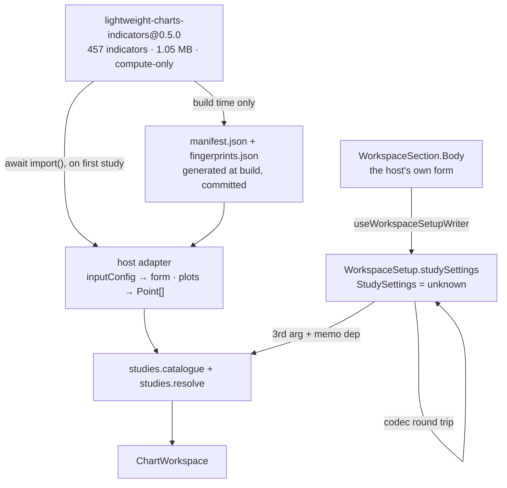

# Indicator library adoption — Design

**Spec**: `.specs/features/indicator-library-adoption/spec.md` (39 requirements, `validate_spec.py` exit 0)
**Status**: Draft

Every number here was produced by running something. Anything not measured says so.

---

## Architecture Overview

The library's bytes and its vocabulary stay in the host. The package earns exactly the two things a
host cannot do alone: a study identified by something other than the text on screen, and per-tab
parameter values it stores without ever reading.



The seam is one sentence: **the host computes and names; the package composes, lays out and
remembers.** `StudySettings = unknown` is that sentence written where the compiler can enforce it —
this package cannot read a member of an `unknown` without a narrowing it is forbidden to write.

---

## Approaches considered

| | What | Verdict |
| --- | --- | --- |
| **A — RECOMMENDED** | Identity is a function (`entry.id ?? entry.label`); values are a parallel map keyed by it; every new member optional | Chosen. Zero host breakage, `indicators` stays `readonly string[]`, `coerceIndicators` keeps its exact signature |
| B | `indicators` becomes `readonly StudyChoice[]` | Rejected. **+113 B** *and* breaks 26 in-repo call sites plus every host. `movedIndicator`, `laneOrder`, `onRemove`, `onMove` and `coerceIndicatorList` all take strings |
| C | The value is a `string` the host serialises | Rejected. Byte-identical to A, and it moves a serialisation decision into a place that has no reason to hold one |

---

## Components and interfaces

### `src/react/SeriesMenu.tsx` — identity

```ts
export interface SeriesCatalogueEntry {
  readonly provider: SeriesProvider;
  /** The STORED identity. Absent, the label stands in, so a catalogue built before this keeps resolving. */
  readonly id?: string;
  readonly label: string;
  readonly category: string;
  readonly hint?: string;
}

/** The ONE answer to "which study is this" — the menu's pressed state and the pick share it. */
export const studyIdentity = (entry: SeriesCatalogueEntry): string => entry.id ?? entry.label;
```

**This repairs a live defect in 0.2.1.** `SeriesMenu.tsx:331` presses on `String(entry.provider.id)`
while `ChartWorkspace.tsx:298` stores `entry.label`. Measured through the real composition:
`STORED=[Average, 20 bars] PRESSED_AFTER_PICK=false`. Picking a study does not light its chip. Every
existing test passes over it because `chrome.spec.tsx:345` mounts `SeriesMenu` with provider ids.

### `src/tabs/setup.ts` — the opaque channel

```ts
export type StudySettings = unknown;

// on WorkspaceSetup
readonly studySettings?: Readonly<Record<string, StudySettings>>;

// on WorkspaceSetupPolicy — a SIBLING of coerceIndicators, not a widening of it
readonly coerceStudySettings?: (
  raw: unknown,
  indicators: readonly string[],
) => Readonly<Record<string, StudySettings>>;
```

Key pruning uses `Object.hasOwn`, never `in`. **Measured on the first draft, which used `in`:**
`onlyActive({}, ['toString'])` returned `{toString: <function>}` — the package fabricating a value the
host never wrote, PARAM-03 violated by the code meant to serve it. Reachable because ids come from a
457-entry third-party registry and because a host may load someone else's workspace file.

**When `coerceStudySettings` is absent, values pass through, key-pruned** (+17 B). The first draft
emptied them silently; measured, a policy that never declares the member now hands `resolve`
`{"ids":["ma"],"settings":{"ma":{"period":50}}}` after a remount.

### `src/react/workspace/ChartWorkspace.tsx` — the redraw path

```ts
readonly resolve?: (
  ids: readonly string[],
  bars: readonly Bar[],
  settings?: Readonly<Record<string, StudySettings>>,
) => SourceResolution;
```
```ts
const resolved = useMemo(
  () => studies.resolve?.(setup.indicators, bars, setup.studySettings),
  [studies, setup.indicators, bars, setup.studySettings],
);
```

**Without this the feature does not work.** `setup.studySettings` was neither an argument nor a
dependency, so editing a value produced a new `setup` whose `indicators` was the same array reference —
no recompute, no redraw. Widening is non-breaking, proven under `--strict`: a host's existing
`(ids, bars) => …` stays assignable to the three-parameter type.

**No memoisation trap, proven in a mounted `<ChartWorkspace>`:** `MEMO afterPick=4
afterIdleRerender=4` — a forced re-render with nothing changed does not re-resolve, because
`studySettings` is a new object per *coercion*, not per render. Writing a value does re-resolve:
`REDRAW calls=5 lastSettings={"ma":{"period":50}}`.

### `src/react/chrome/labels.ts` — one sentence replacing four

```ts
export const outsideProvider = (hook: string, provider: string): string =>
  `${hook} was called outside ${provider}. Mount the provider above the regions that read it.`;
```

Four near-identical diagnostics exist at `setupContext.tsx:76,89`, `DrawingRail.tsx:160`,
`ChromeContext.tsx:167`, and **no test asserts any of them**. Publishing `useWorkspaceSetup` turns
that throw path from a private invariant into a public contract, so the collapse ships with the
discriminating test that never existed.

### `src/index.ts` — three publications

```ts
export { studyIdentity } from './react/SeriesMenu';
export type { StudySettings } from './tabs/setup';
export { useWorkspaceSetup, useWorkspaceSetupWriter } from './react/workspace/setupContext';
```

**Why this is not what AD-017 refused.** AD-017 refused publishing `useDrawingRail` because it would
freeze ten members of `DrawingRailValue` to hand a host one boolean. `useWorkspaceSetup<T>(select)`
freezes nothing new — `WorkspaceSetup` is already published — and its legal call site already exists:
a `WorkspaceSection.Body`, which `ChartWorkspace` renders inside both providers. AD-017's own rule
("the library draws, the host names") is what the form obeys by staying out of `src/`: 457 indicators
× up to 6 inputs is not an enumerable vocabulary and `chrome.labels` is a closed record.

### What the package does NOT gain

`SourceResolution.cut` was designed, measured at **+44 B**, and dropped. `views = ordered.map(...)` at
both exits of `resolveSources`, over the list `laneOrder` already deduplicated and cut, so
`ids.length - views.length` is exact — proven executably: `CUT withBars=4 / noBars=4 / dup=2`, drawn
`a,b,c` unchanged. Nothing in `src/` would have read the member, so forgetting it would have lit
nothing up.

---

## The host side

| Piece | Where | Note |
| --- | --- | --- |
| Vendor → domain | `example/` | Each `Point` built from `bars[index].time` **by index**, taking only `value` from the vendor |
| Form | a module-scope `WorkspaceSection.Body` | State outside the React tree; one section, never reordered |
| Catalogue | generated manifest, committed | Names visible before the library loads |
| Load | `await import()` on first study | ~265.6 KB gzip off the boot path |

**Building each `Point` by index neutralises a whole class.** `double-macd` emits points shifted −2
bars, reproduced on two different grids. `availability.ts:36-47` does `readings[at] = readingOf(point)`
— **last write wins** — and `bars[i-2].time` IS on the grid, so such a point does not get discarded, it
**overwrites the legitimate reading**. Taking the time from the bar index removes the vector for all
457, and is sound because `fullLength` measured 457/457.

**The `import()` must survive the bundler.** `scripts/e2e-demo.mjs` and `scripts/build-example.mjs` use
`outfile` without `splitting`, and esbuild then inlines the dynamic module: measured **1,122,785 B at
boot vs 17,943 B** with `outdir` + `splitting: true`. Sixty-two times, with nothing red.

**Focus in the form — measured, and the feared cause is false.** `count` changing does not remount the
`Body`: React reconciles by `element.type`, which is the function reference, and `count` never reaches
the `Body`. What does lose the caret: a `Body` built inline in the host's render (lost on the first
character), the pointer resting 140 ms over another rail tab, and the host reordering `sections`.

---

## Curation

Two funnels were built independently and reconciled: **318 vs 326, differing by exactly 8**, which is
precisely the two steps one has and the other lacks. Verification tiers, carried per indicator in the
manifest: **T1 pinned 6 · T2 family-constrained 128 · T3 no strong oracle 184.**

Offering only the 134 with an oracle was rejected: absence of a strong oracle is not evidence of error,
and cutting 184 indicators where nothing was found wrong is the false-firing gate at catalogue scale.
All 318 are proven to draw, to be deterministic and pure, to sit on the right scale, and — the owner's
second condition — **every offered input demonstrably moves the output**, or is written into a ledger
with a reason.

Three exclusions are definitional, each confirmed here on independent bars:
`td-macd` (declares `plot0` a histogram, returns the MACD line — `plot0 === plot1` in 580/580, maxdiff
0), `double-macd` (same class), `transient-zones` (Channel High below Channel Low in 590/590).

---

## Byte strategy

| Stack | entry | ChartWorkspace |
| --- | ---: | ---: |
| baseline, measured | 104973 | 95702 |
| **final** | **104969 (−4)** | **95625 (−77)** |

Ceiling untouched; the highest admissible pin is 104993 (`toBeLessThan(104994)`), so **20 B** is the
growth budget from today — which is why nothing that grows can land before the shrinkages.

Growths: identity +22 · settings map +82 · prune +155 · publish hooks +53 · `studyIdentity` +20 ·
notice at pick +175 · redraw widening +32 · pass-through +17. Shrinkages: the four diagnostics into one
factory **−319**, the duplicated rail-tab style literals into one **−159**.

**The pick extraction was refused on measurement**: +47 B and it makes `ChartWorkspace.tsx` **two lines
worse**. The 0 B lever is JSX density matching the line directly above it, landing the file at 348/350.

---

## Risks & Concerns

| Risk | Mitigation |
| --- | --- |
| `commentBudget` is a live budget nobody had noticed — baseline 1808/9053 = 0.1997, **two lines of slack in the whole repo** | Final 1811/9060 = 0.1999, cap 1812, **+1 line of slack**. The trim deletes only lines that duplicate another comment line in the same file (34 such exist). Two of eight candidates are NOT deletable — they carry the block's closing `*/`; measured by breaking the build with `TS2339` |
| `ChartWorkspace.tsx` at 347/350 code lines and absent from the `fileSize` ledger | JSX density lands it at 348/350. The extraction that seemed obvious makes it worse |
| Five new optional members, against this repo's five recorded cases of one vanishing unnoticed | Two tests mount `<ChartWorkspace>` with a real `WorkspaceStore` and a host `Body` that writes. Kills measured per clause: deleting the memo dep prints `lastSettings={}`, caught only by clause 2; deleting the pass-through prints `firstCall.settings={}`, caught only by clause 4 |
| A numerically wrong indicator passes every layer — **planted and proven**: `wma` with inverted weights (2.32% error) went green everywhere | The seal is honest about tiers rather than implying uniform verification; `mass-index` (default 10 where the threshold needs 25) and `bb-bandwidth` (×100 undeclared) are excluded or corrected in the adapter |
| A vendor upgrade changes 320 numbers with the suite green — the manifest check compares names and shapes only | `fingerprints.json` of per-indicator digests, re-derived by the same check (ADAPT-10). Vendor version pinned EXACTLY, the doctrine `size-budget.json` already applies to esbuild |
| An offered control freezes the tab permanently — `maxFactor`, `min:0`, no `max`: 6 ms → **12,280 ms**, persisted | ADAPT-08: bound it or do not offer it |
| The fixed gate stays bypassable via `import(m)` / template literal / concatenation, and `require(m)` is already invisible today | GATE-05/06: the predicate fails CLOSED — a specifier the guard cannot read is itself a violation |
| Vendor renames an id and the saved values die with it | The host's own `coerceIndicators`, which is the injected migration point. An alias table in `src/` would put vendor vocabulary where `:783` bans it |

---

## Execution order, and what it forces

The order is not preference; each position is forced by a gate.

1. **GATE-01..06** — free and safe: `grep -rn "import(" src/` returns zero, so nothing existing changes
2. **Comment trim + JSX density** — 0 B, no re-pin. Must precede both the shrinkage and any commit adding a line to `ChartWorkspace.tsx`: `S1d` alone leaves the aggregate at 0.2001, RED
3. **`S1d` −319 B**, then **`S2` −159 B** — one measured candidate per re-pin, so they cannot share a commit
4. Identity, then the notice at pick with `workspaceLabels` 85→86
5. The settings map with the `socketParity` ledger, then the redraw widening with its test
6. Publish the hooks, with `gen-reference.mjs` regenerated
7. `outdir` + `splitting`, before the example imports the library
8. Harness, then the manifest generator, then the adapter, then the e2e
9. AD-019 recorded, AD-006 marked superseded on its example clause only

**Cannot share a commit**: `S1d` and `S2`. **Must share**: trim + density; the redraw widening and its
test; any published symbol and the regenerated reference; any byte delta and both pins.

---

## Decision log

`AD-019` supersedes **only the example clause** of AD-006. AD-006's `src/` clause stands, and
`boundary.spec.ts:514` still fails on the name. What was overturned: "the host computes" is a statement
about who, not about how well — and the vendor's arithmetic was cross-checked against this repo's own
hand-written implementations at ~1e-13, with `histogram == macd − signal` exactly zero. The defects
AD-006 cited are real and have grown to fifteen, but they are metadata and API-surface defects, which
argue for a curated adapter rather than for re-deriving 457 indicators by hand.
